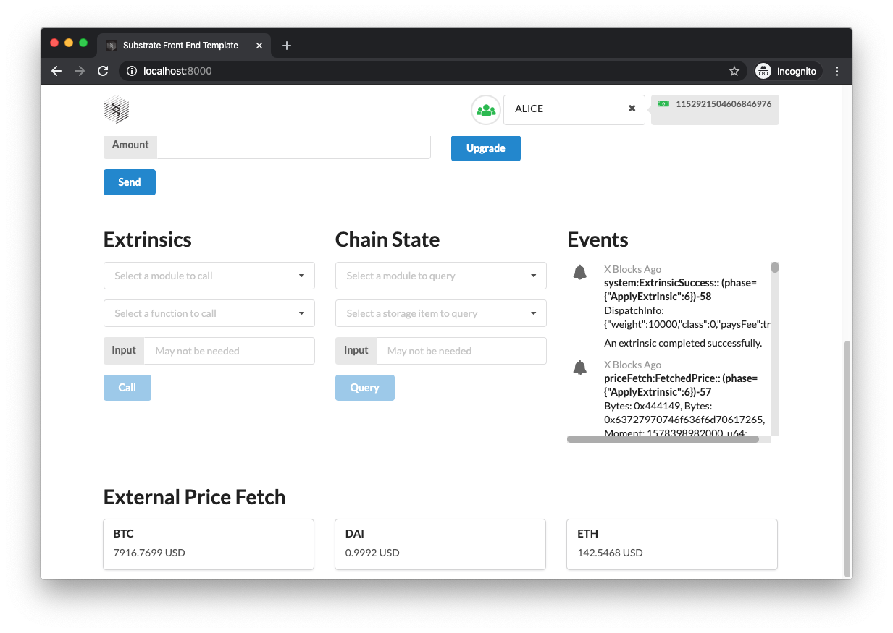

# Substrate Offchain Price Fetch

## Project Motivation

It is often necessary we fetch external data in our blockchain applications. In traditional application this can be done in a simple HTTP Restful fetch. But it is not possible to do it in blockchain runtime. First it is not necessary for every node in the network to send a request to the remote end. Second the http requests does not return a deterministic result, there maybe network delays, or even errors, and we are not sure how long the request will take to return. This can possibly cause block production delay and problems.

What we need is something of a worker that is outside of the normal state transition cycle during block production, an off-chain worker, that is executed by a few dedicated nodes in the network.

[Substrate](https://github.com/paritytech/substrate), a flexible blockchain development framework does offer such [Off-chain Workers](https://substrate.dev/docs/en/next/conceptual/core/off-chain-workers) feature. This project is a demonstration of this feature.

This project consists of a Substrate node with a [custom pallet](node/runtime/src/price_fetch.rs) that use off-chain worker to fetch prices of a few cryptocurrencies, each from two external sources and then aggregate them by simple averaging and record back to on-chain storage.

## How It Works

This project has a setup of using [Substrate Node Template](https://github.com/substrate-developer-hub/substrate-node-template) in the [`node`](node) folder, and [Substrate Front-end Template](https://github.com/substrate-developer-hub/substrate-front-end-template) in the [`frontend`](frontend) folder.

The meat of the project is in [`node/runtime/src/lib.rs`](node/runtime/src/lib.rs) and [`node/runtime/src/price_fetch.rs`](node/runtime/src/price_fetch.rs).

### 1. `node/runtime/src/lib.rs`

In this file, in addition to the regular lib setup, we specify a `SubmitPFTransaction` type and pass in this as the associated type for our pallet trait. We then implement the `system::offchain::CreateTransaction` trait afterwards as follows:

```rust
// -- snip --
type SubmitPFTransaction = system::offchain::TransactionSubmitter<
  price_fetch::crypto::Public,
  Runtime,
  UncheckedExtrinsic
>;

parameter_types! {
  pub const BlockFetchDur: BlockNumber = 2;
}

impl price_fetch::Trait for Runtime {
  type Event = Event;
  type Call = Call;
  type SubmitSignedTransaction = SubmitPFTransaction;
  type SignAndSubmitTransaction = SubmitPFTransaction;
  type SubmitUnsignedTransaction = SubmitPFTransaction;
  type BlockFetchDur = BlockFetchDur;
}

impl system::offchain::CreateTransaction<Runtime, UncheckedExtrinsic> for Runtime {
  type Public = <Signature as Verify>::Signer;
  type Signature = Signature;

  fn create_transaction<TSigner: system::offchain::Signer<Self::Public, Self::Signature>> (
    call: Call,
    public: Self::Public,
    account: AccountId,
    index: Index,
  ) -> Option<(Call, <UncheckedExtrinsic as sp_runtime::traits::Extrinsic>::SignaturePayload)> {
    // ...
  }
}

// -- snip --
```

### 2. `node/runtime/src/price_fetch.rs`

Feel free to look at the [src code](node/runtime/src/price_fetch.rs) side by side with the following description.

Note the necessary included modules at the top for:

  - `system::{ offchain, ...}`, off-chain workers, for submitting transaction
  - `simple_json`, a lightweight json-parsing library that work in `no_std` environment
  - `sp_runtime::{...}`, some libraries to handle HTTP requests and sending transactions back on-chain.

The main logic of this pallet goes as:

- After a block is produced, `offchain_worker` function is called. This is the main entry point of the Substrate off-chain worker. It checks that for every `BlockFetchDur` blocks (set in `lib.rs`), the off-chain worker goes out and fetch the price based on the config data in `FETCHED_CRYPTOS`.

- For each entry of the `FETCHED_CRYPTOS`, it execute the `fetch_price` function, and get the JSON response back from `fetch_json` function. The JSON is parsed for a specific format to return the price in (USD dollar * 1000) in integer format.

- We then submit an unsigned transaction to call the on-chain extrinsics `record_price` function to record the price. All unsigned transactions by default are regarded as invalid transactions, so we explicitly enable them in the `validate_unsigned` function.

- On the next block generation, the price is stored on-chain. The `SrcPricePoints` stores the actual price + timestamp (price point), and `TokenSrcPPMap` and `RemoteSrcPPMap` are the indices mapping the cryptocurrency and remote src to the price point. Finally `UpdateAggPP` are incremented by one, so later we know the denominator to use when calculating the mean of the crypto price.

- Once the block is generated, `offchain_worker` function kicks in again, and see that `UpdateAggPP` have mapping value(s) greater than 0, then the medianizer, `aggregate_pp` kicks in. This function retrieves the last `UpdateAggPP` mapping value (passed in to the function as `freq` parameter) of that crypto prices and find the mean. Then we submit an unsigned transaction to call the on-chain extrinsics `record_agg_pp` function to record the mean price of the cryptocurrencies, with logic similar to the `record_price` function.

## Frontend

It is based on [Substrate Front-end Template](https://github.com/substrate-developer-hub/substrate-front-end-template) with a new section to show cryptocurrency prices.



## How to Run

- For the node, same instructions as [Substrate Node Template](https://github.com/substrate-developer-hub/substrate-node-template)

- For front end, same instructions as [Substrate Front-end Template](https://github.com/substrate-developer-hub/substrate-front-end-template)

## Further Enhancement

- Tracked in [this issue](#11)
